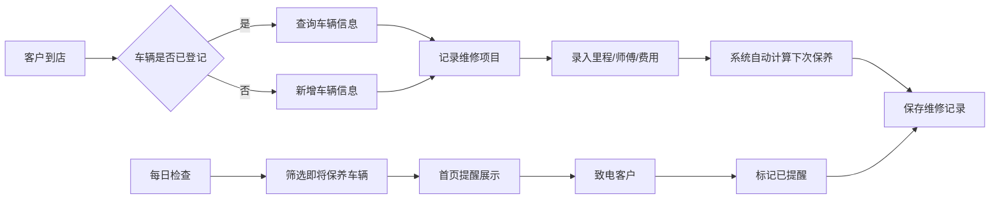

## 1. 产品概述

汽修店车辆管理与保养提醒系统，专为小型汽修店设计，用于管理客户车辆信息、记录维修历史、自动计算下次保养时间并提醒，同时提供月度统计和打印保养记录功能。

- 目标用户：小型汽修店老板、前台接待、维修师傅
- 核心价值：提升客户管理效率，减少客户流失，通过保养提醒增加回头客

## 2. 核心功能

### 2.1 用户角色
| 角色 | 登录方式 | 核心权限 |
|------|----------|----------|
| 店主/管理员 | 本地账号 | 全部功能，包括数据管理、统计报表、系统设置 |
| 维修师傅 | 本地账号 | 查看车辆信息、记录维修、查看保养提醒 |

### 2.2 功能模块
1. **首页仪表盘**：待提醒客户、今日到店、快速统计
2. **车辆管理**：车辆信息增删改查、车主信息管理
3. **维修记录**：记录每次维修项目、里程数、维修师傅、费用
4. **保养提醒**：自动计算下次保养时间、提醒列表、提醒状态管理
5. **统计报表**：月度故障统计、师傅效率排名、收入统计
6. **打印功能**：保养记录单打印

### 2.3 页面详情
| 页面名称 | 模块名称 | 功能描述 |
|-----------|-------------|---------------------|
| 首页仪表盘 | 待提醒卡片 | 展示即将到保养期的车辆列表，一键拨打电话 |
| 首页仪表盘 | 快速统计 | 本月维修次数、本月收入、待提醒数量、活跃车辆数 |
| 首页仪表盘 | 快捷操作 | 快速添加车辆、快速记录维修 |
| 车辆管理 | 车辆列表 | 分页展示所有车辆，支持按车牌/车主搜索 |
| 车辆管理 | 车辆详情 | 展示车辆基本信息、历史维修记录、下次保养信息 |
| 车辆管理 | 新增/编辑车辆 | 表单录入车牌、车主、电话、车型等信息 |
| 维修记录 | 记录列表 | 按时间倒序展示所有维修记录 |
| 维修记录 | 新增维修 | 选择车辆、录入里程、选择维修项目、维修师傅、费用 |
| 保养提醒 | 提醒列表 | 展示所有待提醒车辆，按紧急程度排序 |
| 保养提醒 | 提醒管理 | 标记已提醒、已到店、延后提醒 |
| 统计报表 | 故障统计 | 月度故障类型分布柱状图 |
| 统计报表 | 师傅排名 | 按维修数量/效率排名的师傅榜单 |
| 统计报表 | 收入趋势 | 月度收入折线图 |
| 系统设置 | 保养设置 | 设置保养间隔里程（默认5000公里） |
| 系统设置 | 师傅管理 | 维护维修师傅信息 |

## 3. 核心流程

### 3.1 记录维修流程
客户到店 → 查询/新增车辆 → 记录本次维修信息（里程、项目、师傅、费用）→ 系统自动计算下次保养里程 → 保存记录

### 3.2 保养提醒流程
系统每日检查保养到期车辆 → 展示在首页待提醒区域 → 致电客户 → 标记已提醒 → 客户到店后记录维修

### 3.3 Mermaid 流程图

## 4. 用户界面设计

### 4.1 设计风格
- 主色调：深蓝色（#1e3a5f），代表专业、可信
- 辅助色：橙色（#f97316），用于提醒、按钮等强调元素
- 中性色：深灰、中灰、浅灰层次分明
- 按钮风格：圆角矩形，悬停有阴影和轻微放大效果
- 字体：使用 "Noto Sans SC" 作为中文字体，清晰易读
- 布局风格：卡片式布局，左侧导航栏 + 顶部标题栏 + 主内容区
- 图标风格：使用 lucide-react 线性图标，简洁现代

### 4.2 页面设计概览
| 页面名称 | 模块名称 | UI 元素 |
|-----------|-------------|----------|
| 首页仪表盘 | 统计卡片 | 4个彩色统计卡片，数据 + 图标 + 环比变化 |
| 首页仪表盘 | 待提醒列表 | 卡片式列表，显示车牌、车主、剩余里程、电话按钮 |
| 车辆管理 | 车辆列表 | 表格展示，行悬停高亮，操作按钮 |
| 车辆详情 | 信息卡片 | 左右分栏，左侧基本信息，右侧维修历史时间线 |
| 新增维修 | 表单 | 分步表单，先选车辆再填信息 |
| 统计报表 | 图表区域 | 柱状图 + 折线图 + 排名列表 |

### 4.3 响应式
- 桌面端优先设计（1280px 以上）
- 平板端：导航栏收起为图标模式
- 移动端：底部导航栏，卡片单列布局

### 4.4 打印样式
- 专门的打印样式表
- A4 纸张尺寸，黑白友好
- 包含汽修店抬头、车辆信息、维修记录明细、下次保养提醒
