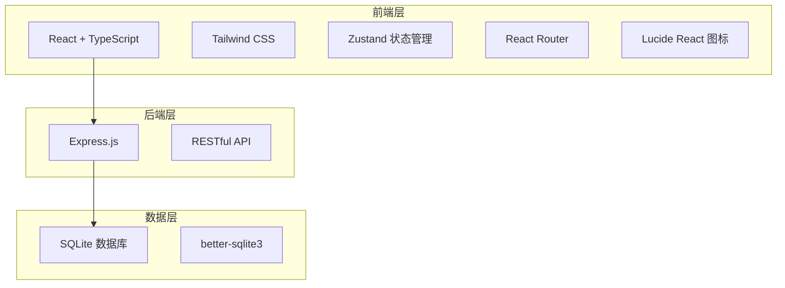
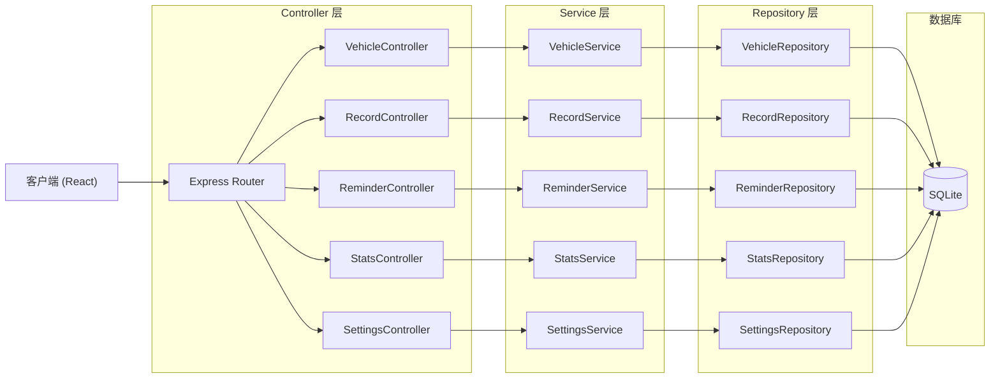
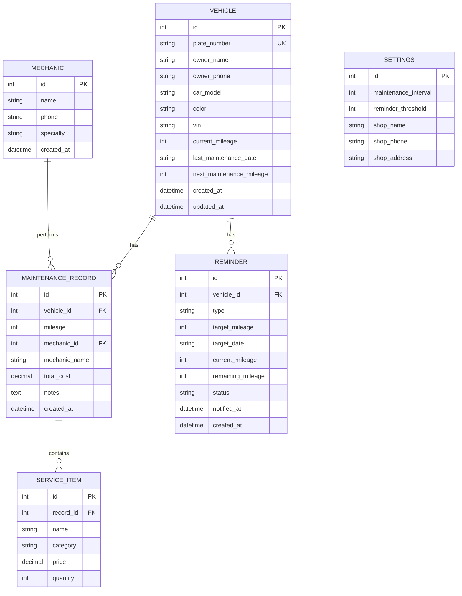

## 1. 架构设计



## 2. 技术描述

- 前端：React@18 + TypeScript + Tailwind CSS@3 + Vite
- 状态管理：Zustand
- 路由：React Router DOM
- 图标：lucide-react
- 后端：Express@4 + TypeScript
- 数据库：SQLite (better-sqlite3)
- 初始化工具：vite-init
- 数据持久化：本地 SQLite 数据库文件

## 3. 路由定义

| 路由路径 | 页面名称 | 用途 |
|----------|----------|------|
| / | 首页仪表盘 | 展示待提醒、统计数据、快捷操作 |
| /vehicles | 车辆列表 | 所有车辆的列表展示和搜索 |
| /vehicles/:id | 车辆详情 | 单辆车的详细信息和维修历史 |
| /vehicles/new | 新增车辆 | 添加新的车辆信息 |
| /records | 维修记录 | 所有维修记录列表 |
| /records/new | 新增维修 | 记录新的维修项目 |
| /reminders | 保养提醒 | 保养提醒列表和管理 |
| /statistics | 统计报表 | 故障统计、师傅排名、收入趋势 |
| /settings | 系统设置 | 保养间隔设置、师傅管理 |
| /print/:vehicleId | 打印页面 | 保养记录单打印 |

## 4. API 定义

### 4.1 车辆相关

```typescript
// 车辆类型
interface Vehicle {
  id: number;
  plateNumber: string;      // 车牌号
  ownerName: string;        // 车主姓名
  ownerPhone: string;       // 车主电话
  carModel: string;         // 车型
  color: string;            // 车身颜色
  vin: string;              // 车架号（可选）
  currentMileage: number;   // 当前里程
  lastMaintenanceDate: string; // 上次保养日期
  nextMaintenanceMileage: number; // 下次保养里程
  createdAt: string;
  updatedAt: string;
}

// GET /api/vehicles - 获取车辆列表
// Query: page, pageSize, keyword
interface GetVehiclesResponse {
  list: Vehicle[];
  total: number;
  page: number;
  pageSize: number;
}

// GET /api/vehicles/:id - 获取车辆详情
// POST /api/vehicles - 新增车辆
// PUT /api/vehicles/:id - 更新车辆
// DELETE /api/vehicles/:id - 删除车辆
```

### 4.2 维修记录相关

```typescript
// 维修记录类型
interface MaintenanceRecord {
  id: number;
  vehicleId: number;
  mileage: number;          // 本次里程
  serviceItems: ServiceItem[]; // 维修项目
  mechanicId: number;       // 维修师傅ID
  mechanicName: string;     // 维修师傅姓名
  totalCost: number;        // 总费用
  notes: string;            // 备注
  createdAt: string;
}

// 维修项目
interface ServiceItem {
  id: number;
  name: string;             // 项目名称（如：换机油、换轮胎）
  category: string;         // 分类（保养/维修/配件）
  price: number;            // 单价
  quantity: number;         // 数量
}

// GET /api/records - 获取维修记录列表
// Query: page, pageSize, vehicleId, startDate, endDate
// GET /api/records/:id - 获取维修记录详情
// POST /api/records - 新增维修记录
// PUT /api/records/:id - 更新维修记录
// DELETE /api/records/:id - 删除维修记录
```

### 4.3 保养提醒相关

```typescript
// 提醒状态
type ReminderStatus = 'pending' | 'notified' | 'completed' | 'postponed';

interface Reminder {
  id: number;
  vehicleId: number;
  vehicle: Vehicle;
  type: 'mileage' | 'date';
  targetMileage?: number;
  targetDate?: string;
  currentMileage: number;
  remainingMileage?: number;
  status: ReminderStatus;
  notifiedAt?: string;
  createdAt: string;
}

// GET /api/reminders - 获取提醒列表
// Query: status, page, pageSize
// PUT /api/reminders/:id/status - 更新提醒状态
// POST /api/reminders/:id/postpone - 延后提醒
```

### 4.4 统计相关

```typescript
// GET /api/statistics/dashboard - 仪表盘统计
interface DashboardStats {
  totalVehicles: number;
  thisMonthRecords: number;
  thisMonthRevenue: number;
  pendingReminders: number;
}

// GET /api/statistics/service-types - 故障类型统计
interface ServiceTypeStats {
  name: string;
  count: number;
  percentage: number;
}[]

// GET /api/statistics/mechanics - 师傅排名
interface MechanicStats {
  id: number;
  name: string;
  recordCount: number;
  totalRevenue: number;
  avgCost: number;
}[]

// GET /api/statistics/revenue - 收入趋势
interface RevenueStats {
  month: string;
  revenue: number;
  recordCount: number;
}[]
```

### 4.5 系统设置相关

```typescript
// 师傅类型
interface Mechanic {
  id: number;
  name: string;
  phone: string;
  specialty: string;
  createdAt: string;
}

// 系统设置
interface Settings {
  maintenanceInterval: number; // 保养间隔里程（默认5000）
  reminderThreshold: number;   // 提前提醒里程（默认1000）
  shopName: string;            // 店铺名称
  shopPhone: string;           // 店铺电话
  shopAddress: string;         // 店铺地址
}

// GET /api/settings - 获取系统设置
// PUT /api/settings - 更新系统设置
// GET /api/mechanics - 获取师傅列表
// POST /api/mechanics - 新增师傅
// PUT /api/mechanics/:id - 更新师傅
// DELETE /api/mechanics/:id - 删除师傅
```

## 5. 服务端架构图



## 6. 数据模型

### 6.1 数据模型 ER 图



### 6.2 DDL 语句

```sql
-- 车辆表
CREATE TABLE vehicles (
  id INTEGER PRIMARY KEY AUTOINCREMENT,
  plate_number TEXT NOT NULL UNIQUE,
  owner_name TEXT NOT NULL,
  owner_phone TEXT NOT NULL,
  car_model TEXT,
  color TEXT,
  vin TEXT,
  current_mileage INTEGER DEFAULT 0,
  last_maintenance_date TEXT,
  next_maintenance_mileage INTEGER DEFAULT 0,
  created_at TEXT DEFAULT (datetime('now')),
  updated_at TEXT DEFAULT (datetime('now'))
);

CREATE INDEX idx_vehicles_plate ON vehicles(plate_number);
CREATE INDEX idx_vehicles_owner ON vehicles(owner_name);

-- 维修记录表
CREATE TABLE maintenance_records (
  id INTEGER PRIMARY KEY AUTOINCREMENT,
  vehicle_id INTEGER NOT NULL,
  mileage INTEGER NOT NULL,
  mechanic_id INTEGER,
  mechanic_name TEXT,
  total_cost REAL DEFAULT 0,
  notes TEXT,
  created_at TEXT DEFAULT (datetime('now')),
  FOREIGN KEY (vehicle_id) REFERENCES vehicles(id)
);

CREATE INDEX idx_records_vehicle ON maintenance_records(vehicle_id);
CREATE INDEX idx_records_date ON maintenance_records(created_at);
CREATE INDEX idx_records_mechanic ON maintenance_records(mechanic_id);

-- 维修项目表
CREATE TABLE service_items (
  id INTEGER PRIMARY KEY AUTOINCREMENT,
  record_id INTEGER NOT NULL,
  name TEXT NOT NULL,
  category TEXT,
  price REAL DEFAULT 0,
  quantity INTEGER DEFAULT 1,
  FOREIGN KEY (record_id) REFERENCES maintenance_records(id) ON DELETE CASCADE
);

CREATE INDEX idx_items_record ON service_items(record_id);

-- 师傅表
CREATE TABLE mechanics (
  id INTEGER PRIMARY KEY AUTOINCREMENT,
  name TEXT NOT NULL,
  phone TEXT,
  specialty TEXT,
  created_at TEXT DEFAULT (datetime('now'))
);

-- 提醒表
CREATE TABLE reminders (
  id INTEGER PRIMARY KEY AUTOINCREMENT,
  vehicle_id INTEGER NOT NULL,
  type TEXT NOT NULL DEFAULT 'mileage',
  target_mileage INTEGER,
  target_date TEXT,
  current_mileage INTEGER,
  remaining_mileage INTEGER,
  status TEXT NOT NULL DEFAULT 'pending',
  notified_at TEXT,
  created_at TEXT DEFAULT (datetime('now')),
  FOREIGN KEY (vehicle_id) REFERENCES vehicles(id)
);

CREATE INDEX idx_reminders_status ON reminders(status);
CREATE INDEX idx_reminders_vehicle ON reminders(vehicle_id);

-- 设置表
CREATE TABLE settings (
  id INTEGER PRIMARY KEY DEFAULT 1,
  maintenance_interval INTEGER DEFAULT 5000,
  reminder_threshold INTEGER DEFAULT 1000,
  shop_name TEXT DEFAULT '汽修店',
  shop_phone TEXT,
  shop_address TEXT
);

-- 初始化设置
INSERT INTO settings (id) VALUES (1) ON CONFLICT(id) DO NOTHING;
```
